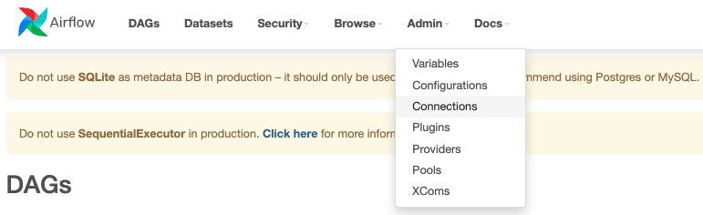

# Airflow APIs with Spark-submit
This repo explains how to trigger an Airflow DAG with airflow APIs, and that DAG is responsible to submit a spark job to a spark cluster

***

## Run Airflow with Python Virtual Environments

* Create virtual environment
```
$ python3 -m venv airflow_venv
```

* Activate the venv
```
$ source airflow_venv/bin/activate
```

* From the official github repo:
https://github.com/apache/airflow

Install airflow 2.6.0 using the below command
make sure to change the **"`constraints-3.xx`"** to your python version
```
$ pip install "apache-airflow[celery]==2.6.0" --constraint "https://raw.githubusercontent.com/apache/airflow/constraints-2.6.0/constraints-3.10.txt"
 ```

* After installation, export `AIRFLOW_HOME` to the desired directory
```
$ export AIRFLOW_HOME=$(pwd)/airflow_venv
```

* Initialize the database with:
```
$ airflow db init
```

* Check db connection using:
```
$ airflow db check
```

* Change `load_examples` in the **`airflow.cfg`** file to "False" if you don't want to load the initial examples:
```
load_examples = False
```

### **Enabeling REST APIs connection:**
* In order to make Airflow accept REST APIs connections, you need to change the value of "`auth_backends`" in the "`airflow.cfg`" to the below value:

```
auth_backends = airflow.api.auth.backend.basic_auth
```
* **You need to reload airflow webserver and airflow scheduler accordingly in case of previous running**

* In order to check if the value in changed, use the below command:
```
$ airflow config get-value api auth_backends
```

* Start Airflow webserver in port `8080`:
```
$ airflow webserver -p 8080
```

* Open another terminal window: 
    * Change your directory into AIRFLOW directory if not
    * Source into your virtual environment
    * Export airflow home by "`export AIRFLOW_HOME=$(pwd)/airflow_venv`"
    * And Create a user for logging into airflow by:
```
$ airflow users create \
    --username airflow \
    --firstname fname \
    --lastname lname \
    --email admin@domain.com \
    --role Admin
```

* In the new terminal window, start airflow scheduler
```
$ airflow scheduler
```

* Create a new folder inside the `airflow_venv` called **"`dags`"**. Inside it, create a new testing dag file (if needed) called **"`simple_dag.py`"**, with the below content:
```
from datetime import datetime
from airflow import DAG
from airflow.decorators import task
from airflow.operators.bash import BashOperator

with DAG(dag_id="simple_dag", start_date=datetime(2023, 2, 1), schedule="0 0 * * *")as dag:

    hello_task = BashOperator(task_id="Hello_from_bash", bash_command="echo hello from bash")

    @task
    def airflow_task():
        print("hello from airflow task")

    hello_task >> airflow_task()
```

* Copy the "`dags/spark_submit_dag.py`" file in this repo to the "`dags`" folder you created inside the "`airflow_venv`". Then make sure it is loaded in airflow webUI after refreshing.

* Use the cURL commands in the file "`airflow_apis/curl_apis.sh`" in this repo to test the airflow APIs. There are two APIs, one for listing dags, and another for triggering a dag.

* Make sure to amend the "`spark_default`" connection in airflow to match you spark cluster parameters:



***
### **To Rerun Airflow Again After the First Setup**
* Terminal window 1:
```
$ export AIRFLOW_HOME=$(pwd)/airflow_venv
$ airflow webserver -p 8080
```
* Terminal window 2:
```
$ export AIRFLOW_HOME=$(pwd)/airflow_venv
$ airflow scheduler
```
